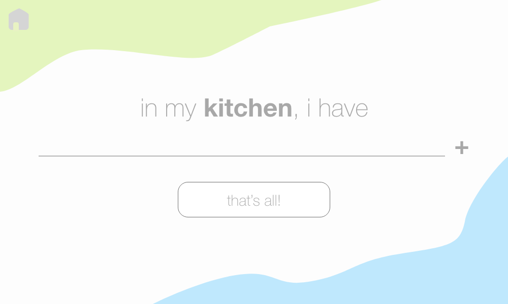
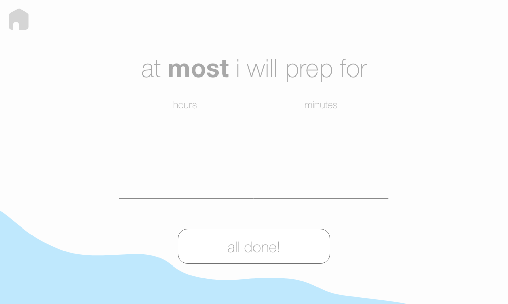

&nbsp; Recipe suggestions based on available ingredients, time, and allergies.
 
 
 

# Screenshots

# Stack
- Recipe data pulled from [Fatsecret API](http://www.fatsecret4j.com)
- GUI design in Adobe XD
- Interactive GUI parts written in Java Swing

# Team
| **Vishal Chandra** | **Sophia Hübscher** |
| :---: | :---:|
|  |  |
| <a href="http://github.com/vishal-chandra" target="_blank">`github.com/vishal-chandra`</a> | <a href="http://github.com/sophia-hubscher" target="_blank">`github.com/sophia-hubscher`</a>|
>Made @ LexHack 2018
